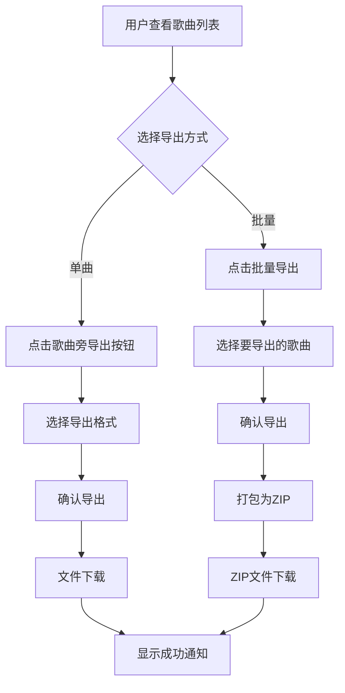
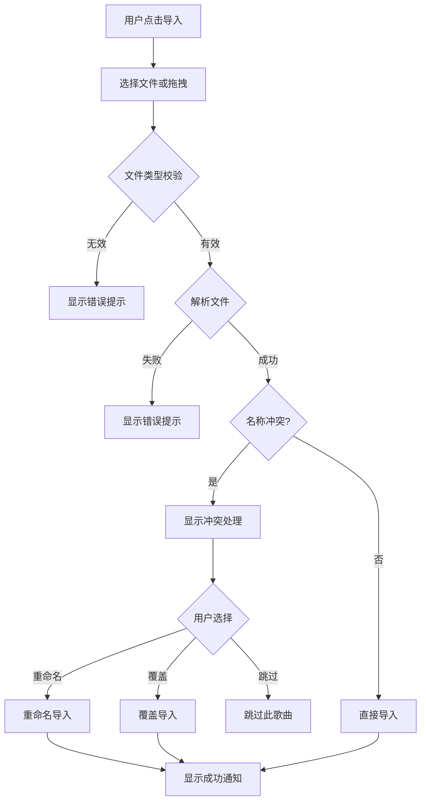

# 用户体验设计（用户视角）

> 歌曲导入导出功能 - 交互设计与界面布局

---

## 目录

1. [设计原则](#1-设计原则)
2. [界面布局](#2-界面布局)
3. [交互设计](#3-交互设计)
4. [操作流程](#4-操作流程)
5. [文案设计](#5-文案设计)
6. [错误处理](#6-错误处理)

---

## 1. 设计原则

### 1.1 核心原则

| 原则 | 说明 | 实现方式 |
|------|------|----------|
| **简单易用** | 一键导出/导入，无需复杂配置 | 默认选项最优 |
| **即时反馈** | 每个操作都有明确响应 | 进度提示、成功/失败通知 |
| **容错友好** | 错误提示清晰，提供解决方案 | 具体错误原因 + 建议操作 |
| **一致性** | 与现有界面风格统一 | 复用现有组件和样式 |

### 1.2 设计理念

```
┌─────────────────────────────────────────────────────────────────┐
│                      设计理念：无感备份                          │
├─────────────────────────────────────────────────────────────────┤
│                                                                 │
│  ❌ 不要让用户思考：                                             │
│     "我该选什么格式？"                                           │
│     "这些选项是什么意思？"                                        │
│     "我的数据安全吗？"                                            │
│                                                                 │
│  ✅ 让用户只需要：                                               │
│     点击"导出" → 完成                                           │
│     点击"导入" → 完成                                           │
│                                                                 │
└─────────────────────────────────────────────────────────────────┘
```

---

## 2. 界面布局

### 2.1 整体布局

在现有歌曲列表区域添加导入导出按钮：

```
┌─────────────────────────────────────────────────────────────┐
│  [分析新歌曲]                                                │
│  ┌─────────────────────────────────────────────────────┐    │
│  │  拖拽或点击上传音频文件                              │    │
│  └─────────────────────────────────────────────────────┘    │
│                                                              │
│  ┌─ 歌曲列表 ────────────────────────────────────────┐      │
│  │  歌曲A                        [显示] [导出] [删除] │      │
│  │  歌曲B                        [显示] [导出] [删除] │      │
│  │  歌曲C                        [显示] [导出] [删除] │      │
│  └────────────────────────────────────────────────────┘      │
│                                                              │
│  [批量导出] [导入歌曲]    ← 新增按钮                          │
└─────────────────────────────────────────────────────────────┘
```

### 2.2 按钮设计

#### 2.2.1 单曲操作按钮

在每首歌曲右侧添加"导出"按钮：

```
┌──────────────────────────────────────────────────────────┐
│  🎵 歌曲名称.mp3                                         │
│                                                          │
│  [显示] [导出 ⬇] [删除]                                  │
└──────────────────────────────────────────────────────────┘
```

**按钮样式：**

| 按钮 | 样式 | 图标 |
|------|------|------|
| 显示 | 蓝色背景 | 👁 或无 |
| 导出 | 橙色背景 | ⬇ 下载箭头 |
| 删除 | 灰色背景 | 🗑 或无 |

#### 2.2.2 底部批量操作按钮

```
┌──────────────────────────────────────────────────────────┐
│  [📥 批量导出]    [📤 导入歌曲]    [🗑 清空列表]          │
└──────────────────────────────────────────────────────────┘
```

### 2.3 导出选项弹窗

点击"导出"后显示简洁的选项弹窗：

```
┌─────────────────────────────────────────┐
│  导出歌曲                    [×]         │
├─────────────────────────────────────────┤
│                                         │
│  📦 导出格式                            │
│  ○ Pitch 格式 (.pitch)  ← 默认选中      │
│    完整保存所有数据，可再次导入          │
│                                         │
│  ○ MIDI 格式 (.mid)                     │
│    通用格式，可导入 DAW 软件             │
│                                         │
├─────────────────────────────────────────┤
│           [取消]    [导出]              │
└─────────────────────────────────────────┘
```

### 2.4 导入界面

点击"导入歌曲"后：

```
┌─────────────────────────────────────────────────────┐
│                                                     │
│     📂 拖拽 .pitch 文件到此处                       │
│        或  [点击选择文件]                           │
│                                                     │
│     支持 .pitch 和 .mid 格式                        │
│                                                     │
└─────────────────────────────────────────────────────┘
```

---

## 3. 交互设计

### 3.1 导出交互

#### 3.1.1 单曲导出

```
用户点击"导出"
    │
    ├─→ 显示导出选项弹窗
    │       │
    │       └─→ 用户选择格式并确认
    │               │
    │               ├─→ 显示进度提示（快速操作可能不显示）
    │               │
    │               └─→ 浏览器下载文件
    │                       │
    │                       └─→ 显示成功通知：✅ 已导出 "歌曲名.pitch"
```

**进度提示（仅在处理时间 > 500ms 时显示）：**

```
┌─────────────────────────────────────┐
│  ⏳ 正在导出...                      │
│  ████████░░░░░░░░░░░░  40%          │
└─────────────────────────────────────┘
```

#### 3.1.2 批量导出

```
用户点击"批量导出"
    │
    ├─→ 显示歌曲选择界面（全选/取消）
    │       │
    │       └─→ 用户选择歌曲并确认
    │               │
    │               ├─→ 显示进度弹窗
    │               │       │
    │               │       └─→ 逐首导出并更新进度
    │               │
    │               └─→ 打包为 ZIP 下载
    │                       │
    │                       └─→ 显示成功通知
```

**批量导出进度弹窗：**

```
┌─────────────────────────────────────────────┐
│  批量导出                          [×]       │
├─────────────────────────────────────────────┤
│                                             │
│  正在导出 3/10 首歌曲...                    │
│  ████████████████░░░░░░░░░░░░  30%          │
│                                             │
│  当前：歌曲C                                │
│  ✓ 歌曲A                                    │
│  ✓ 歌曲B                                    │
│  ○ 歌曲C...                                 │
│  ○ 歌曲D                                    │
│  ...                                        │
│                                             │
├─────────────────────────────────────────────┤
│                    [取消]                   │
└─────────────────────────────────────────────┘
```

### 3.2 导入交互

#### 3.2.1 单文件导入

```
用户选择/拖拽文件
    │
    ├─→ 文件类型校验
    │       │
    │       ├─ 有效格式 → 继续
    │       │
    │       └─ 无效格式 → 显示错误提示
    │
    ├─→ 读取并解析文件
    │       │
    │       ├─ 解析成功 → 继续
    │       │
    │       └─ 解析失败 → 显示错误提示
    │
    ├─→ 检查名称冲突
    │       │
    │       ├─ 无冲突 → 直接导入
    │       │
    │       └─ 有冲突 → 显示冲突处理弹窗
    │
    └─→ 写入数据库
            │
            └─→ 显示成功通知：✅ 已导入 "歌曲名"
```

#### 3.2.2 冲突处理弹窗

```
┌─────────────────────────────────────────────┐
│  歌曲名称冲突                      [×]       │
├─────────────────────────────────────────────┤
│                                             │
│  已存在同名歌曲："歌曲名"                    │
│                                             │
│  ○ 重命名导入（推荐）                       │
│    新名称：[歌曲名 (1)        ]             │
│                                             │
│  ○ 覆盖现有歌曲                             │
│    ⚠️ 现有数据将被永久删除                   │
│                                             │
│  ○ 跳过此歌曲                               │
│    保留现有数据不变                          │
│                                             │
├─────────────────────────────────────────────┤
│           [取消]    [确认]                  │
└─────────────────────────────────────────────┘
```

#### 3.2.3 批量导入进度

```
┌─────────────────────────────────────────────┐
│  批量导入                          [×]       │
├─────────────────────────────────────────────┤
│                                             │
│  正在导入 5/8 首歌曲...                     │
│  ███████████████████████░░░░░  62%          │
│                                             │
│  当前：歌曲E                                │
│  ✓ 歌曲A - 已导入                           │
│  ✓ 歌曲B - 已重命名导入                     │
│  ✓ 歌曲C - 已跳过（已存在）                 │
│  ✓ 歌曲D - 已导入                           │
│  ○ 歌曲E...                                 │
│                                             │
├─────────────────────────────────────────────┤
│                    [取消]                   │
└─────────────────────────────────────────────┘
```

---

## 4. 操作流程

### 4.1 典型导出流程



### 4.2 典型导入流程



---

## 5. 文案设计

### 5.1 按钮文案

| 按钮 | 中文 | 英文 |
|------|------|------|
| 导出 | 导出 | Export |
| 批量导出 | 批量导出 | Export All |
| 导入歌曲 | 导入歌曲 | Import Songs |
| 导出格式选择 | 导出格式 | Export Format |

### 5.2 通知文案

| 场景 | 中文 | 英文 |
|------|------|------|
| 导出成功 | ✅ 已导出 "{name}" | ✅ Exported "{name}" |
| 导入成功 | ✅ 已导入 "{name}" | ✅ Imported "{name}" |
| 批量完成 | ✅ 已导出 {n} 首歌曲 | ✅ Exported {n} songs |
| 导出失败 | ❌ 导出失败：{reason} | ❌ Export failed: {reason} |
| 导入失败 | ❌ 导入失败：{reason} | ❌ Import failed: {reason} |

### 5.3 错误提示文案

| 错误类型 | 中文 | 英文 |
|----------|------|------|
| 格式不支持 | 不支持的文件格式，请选择 .pitch 或 .mid 文件 | Unsupported format, please select .pitch or .mid file |
| 文件损坏 | 文件已损坏或格式不正确 | File is corrupted or format is invalid |
| 版本不兼容 | 文件版本不兼容，请更新应用 | File version incompatible, please update app |
| 写入失败 | 保存失败，请检查存储空间 | Save failed, please check storage |

---

## 6. 错误处理

### 6.1 错误分类与处理

| 错误类型 | 用户提示 | 系统处理 |
|----------|----------|----------|
| **文件格式错误** | 明确告知支持的格式 | 不尝试解析 |
| **文件损坏** | 提示文件可能损坏 | 记录错误日志 |
| **版本不兼容** | 提示更新应用 | 尝试兼容模式 |
| **存储空间不足** | 提示清理空间 | 取消操作 |
| **网络错误** | （离线功能，无此问题） | - |

### 6.2 错误提示设计

**内联错误提示：**

```
┌─────────────────────────────────────────────┐
│  ❌ 导入失败                                 │
│                                             │
│  文件格式不正确                              │
│  请确保文件是 .pitch 或 .mid 格式            │
│                                             │
│                    [知道了]                 │
└─────────────────────────────────────────────┘
```

**Toast 通知：**

```
┌─────────────────────────────────────┐
│  ❌ 导出失败：存储空间不足            │
└─────────────────────────────────────┘
```

### 6.3 恢复机制

| 场景 | 恢复方案 |
|------|----------|
| 导出中断 | 可重新导出，无数据损失 |
| 导入中断 | 部分导入的歌曲已保存，可查看 |
| 覆盖操作 | 操作前有确认提示，不可撤销 |

---

## 7. 无障碍设计

### 7.1 键盘支持

| 操作 | 快捷键 |
|------|--------|
| 打开导入 | Ctrl/Cmd + I |
| 打开导出 | Ctrl/Cmd + E |
| 确认操作 | Enter |
| 取消操作 | Escape |

### 7.2 屏幕阅读器支持

- 所有按钮有 `aria-label`
- 进度条有 `aria-valuenow` 等属性
- 错误提示使用 `role="alert"`
